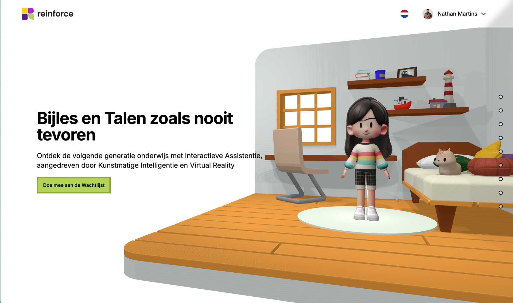

# Reinforce - AI-Powered Educational Support Platform

<div align="center">
  
</div>

## 🎓 About Reinforce

Reinforce is an open source platform that enhances the educational support experience by bringing more interactivity through animated 3D characters, gamification, and AI-powered real-time conversation.

Designed for kids, it offers a fun, interactive, and personalized assistance to solve homework doubts and boost understanding. With real-time conversations adaptable to school-specific materials, Reinforce ensures tailored guidance for every student.

Built for schools and educators, Reinforce empowers educators with customized information about student performance and well-being. The platform can be contextualized with didactic material for better alignment with the school curriculum.

Reinforce seeks to bridge the gap between technology and traditional teaching, creating a seamless educational experience that benefits students, teachers, and educational institutions.

### 🌟 Key Features

- **AI-Powered Mentoring**: Real-time homework help and subject understanding
- **Interactive 3D Environment**: Engaging learning experience with our virtual mentors
- **Lip-Synced 3D Avatars**: Real-time lip-syncing and animations using TalkingHead
- **School-Specific Customization**: Adaptable to each institution's curriculum
- **Multi-language Support**: Available in English, Portuguese, Spanish, and Dutch
- **Homework Management**: Assign, track, and complete homework assignments
- **Real-time Chat**: Instant responses and natural conversations with 3D chat interface
- **Custom Content Integration**: Schools can enhance the AI with their materials
- **Performance Analytics**: Insights for educators on student progress
- **Mouse-Following Camera**: Subtle camera movements that follow the mouse for enhanced immersion

## 🚀 Getting Started

### Prerequisites

- Node.js 18.x or higher
- PNPM package manager
- Firebase account for authentication and database
- ElevenLabs API key for voice synthesis
- TalkingHead library for lip-syncing and animations

### Installation

1. Clone the repository:

```bash
git clone https://github.com/nathanmls/reinforce.git
cd reinforce
```

2. Install dependencies:

```bash
pnpm install
```

3. Set up environment variables:
   Copy the `.env.example` file to `.env.local` and fill in your own values:

```bash
cp .env.example .env.local
```

Then edit the `.env.local` file with your API keys and configuration:

```
LIVEKIT_API_KEY=your_api_key
LIVEKIT_API_SECRET=your_api_secret
LIVEKIT_URL=your_livekit_url
ELEVENLABS_API_KEY=your_elevenlabs_api_key
NEXT_PUBLIC_AGENT_ID=your_agent_id
GOOGLE_TTS_API_KEY=your_google_tts_api_key
XI_API_KEY=your_elevenlabs_api_key
AGENT_ID=your_elevenlabs_agent_id
```

You'll also need to set up Firebase configuration in your `.env.local` file:

```
NEXT_PUBLIC_FIREBASE_API_KEY=your_firebase_api_key
NEXT_PUBLIC_FIREBASE_AUTH_DOMAIN=your_firebase_auth_domain
NEXT_PUBLIC_FIREBASE_PROJECT_ID=your_firebase_project_id
NEXT_PUBLIC_FIREBASE_STORAGE_BUCKET=your_firebase_storage_bucket
NEXT_PUBLIC_FIREBASE_MESSAGING_SENDER_ID=your_firebase_messaging_sender_id
NEXT_PUBLIC_FIREBASE_APP_ID=your_firebase_app_id
```

4. Run the development server:

```bash
pnpm dev
```

5. Open [http://localhost:3000](http://localhost:3000) in your browser.

## 📁 Project Structure

```
reinforce/
├── app/                    # Next.js app directory
│   ├── api/                # API routes
│   ├── app/                # Student app page with 3D scene
│   ├── components/         # Reusable components
│   │   ├── homework/       # Homework management components
│   │   ├── mentors/        # Mentor management components
│   │   ├── scene/          # 3D scene components (includes reusable PortalModel)
│   │   └── ...             # Other UI components
│   ├── config/             # Configuration files
│   ├── context/            # React context providers
│   ├── firebase/           # Firebase configuration
│   ├── models/             # Data models
│   ├── painel/             # Admin panel pages
│   │   ├── dashboard/      # Admin dashboard
│   │   ├── homework/       # Homework management
│   │   ├── institutions/   # Institution management
│   │   ├── mentors/        # Mentor management
│   │   ├── students/       # Student management
│   │   └── users/          # User management
│   ├── services/           # Service layer for API calls
│   ├── translations/       # Internationalization files
│   └── ...                 # Other app-level files
├── public/                 # Static assets
│   ├── models/             # 3D models
│   └── ...                 # Other static files
└── ...                     # Configuration files
```

## 🔧 Technologies

- **Frontend**: Next.js, React, Three.js, React Three Fiber
- **3D Rendering**: Three.js, @react-three/fiber, @react-three/drei
- **Avatar Animation**: TalkingHead for lip-syncing and facial animations
- **Styling**: Tailwind CSS
- **State Management**: React Context API
- **Authentication**: Firebase Authentication
- **Database**: Firebase Firestore
- **Storage**: Firebase Storage
- **Voice Synthesis**: ElevenLabs API
- **Internationalization**: Custom i18n solution

## 👥 User Roles

- **Administrator**: Full access to all features and management capabilities
- **Manager**: Can manage students, mentors, and homework assignments
- **Student**: Can access the 3D app, interact with mentors, and complete homework

## 🔄 Recent Enhancements

- **TalkingHead Integration**: Added real-time lip-syncing and facial animations for more realistic avatar interactions
- **3D Chat Interface**: Integrated chat interface directly in the 3D scene next to the avatar
- **Mouse-Following Camera**: Added subtle camera movements based on mouse position for enhanced immersion
- **Reusable 3D Components**: Created modular and reusable components like PortalModel for easier development
- **Client-Side Rendering Optimizations**: Added client-only wrapper components to prevent SSR issues with Three.js

## 🤝 Contributing

Contributions are welcome! Here's how you can contribute:

1. Fork the repository
2. Create your feature branch (`git checkout -b feature/amazing-feature`)
3. Commit your changes (`git commit -m 'Add some amazing feature'`)
4. Push to the branch (`git push origin feature/amazing-feature`)
5. Open a Pull Request

Please make sure to update tests as appropriate and follow the code style guidelines.

## 🔒 Security

If you discover any security related issues, please email security@reinforce.ai instead of using the issue tracker.

## 📝 License

This project is licensed under the Apache License 2.0 - see the [LICENSE](LICENSE) file for details.

## 📧 Contact

For more information, please open an issue in this repository or contact the maintainers at [info@reinforce.ai](mailto:info@reinforce.ai)
