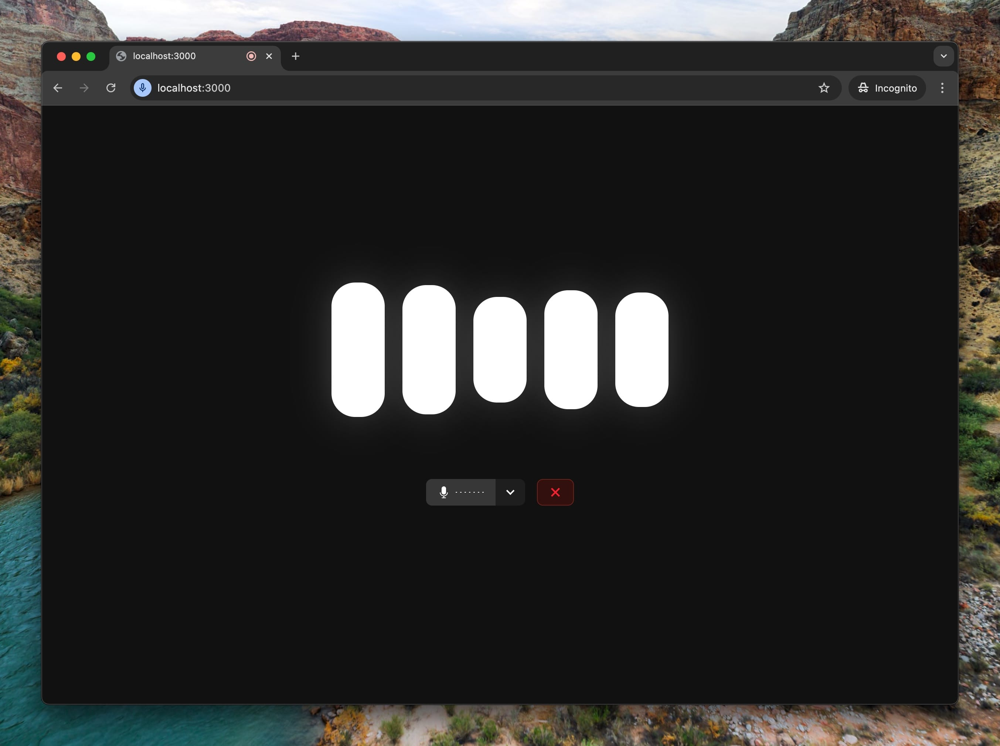

# Reinforce - AI-Powered Educational Support Platform

<div align="center">
  
</div>

## 🎓 About Reinforce

Reinforce is a cutting-edge SaaS platform revolutionizing educational support through advanced AI technology. Our platform features an interactive 3D environment where students can engage with our AI mentor in an immersive and engaging way.

### 🌟 Key Features

- **AI-Powered Mentoring**: Real-time homework help and subject understanding
- **Interactive 3D Environment**: Engaging learning experience with our virtual mentor
- **School-Specific Customization**: Adaptable to each institution's curriculum
- **Multi-language Support**: Available in multiple languages for global accessibility
- **VR-Ready**: Future-proof design with virtual reality support
- **Real-time Chat**: Instant responses and natural conversations
- **Custom Content Integration**: Schools can enhance the AI with their materials

## 🚀 Getting Started

### Prerequisites

- Node.js 18.x or higher
- PNPM package manager
- Firebase account for authentication and database

### Installation

1. Clone the repository:
```bash
git clone https://github.com/nathanmls/reinforce.git
cd reinforce
```

2. Install dependencies:
```bash
pnpm install
```

3. Set up environment variables:
```bash
cp .env.example .env.local
```
Fill in your Firebase and other required credentials in `.env.local`

4. Start the development server:
```bash
pnpm dev
```

## 🛠 Tech Stack

- **Frontend**: Next.js 14, React 18
- **3D Graphics**: Three.js, React Three Fiber
- **Authentication**: Firebase Auth
- **Database**: Firestore
- **Styling**: Tailwind CSS
- **State Management**: React Context
- **Animations**: Framer Motion
- **Language Processing**: Advanced AI Models

## 🏗 Project Structure

```
reinforce/
├── app/                    # Next.js app directory
│   ├── components/         # React components
│   ├── context/           # React context providers
│   └── painel/            # Admin dashboard pages
├── public/                # Static assets
│   ├── models/           # 3D models
│   └── images/           # Image assets
└── scripts/              # Utility scripts
```

## 🤝 Contributing

We welcome contributions! Please see our [Contributing Guidelines](CONTRIBUTING.md) for details.

## 📝 License

This project is licensed under the MIT License - see the [LICENSE](LICENSE) file for details.

## 🔗 Links

- [Website](https://reinforce.ai)
- [Documentation](https://docs.reinforce.ai)
- [Support](mailto:support@reinforce.ai)

## 🌟 Acknowledgments

Special thanks to our team of educators, developers, and early adopters who have helped shape Reinforce into what it is today.

---

<div align="center">
  Built with ❤️ by the Reinforce Team
</div>
